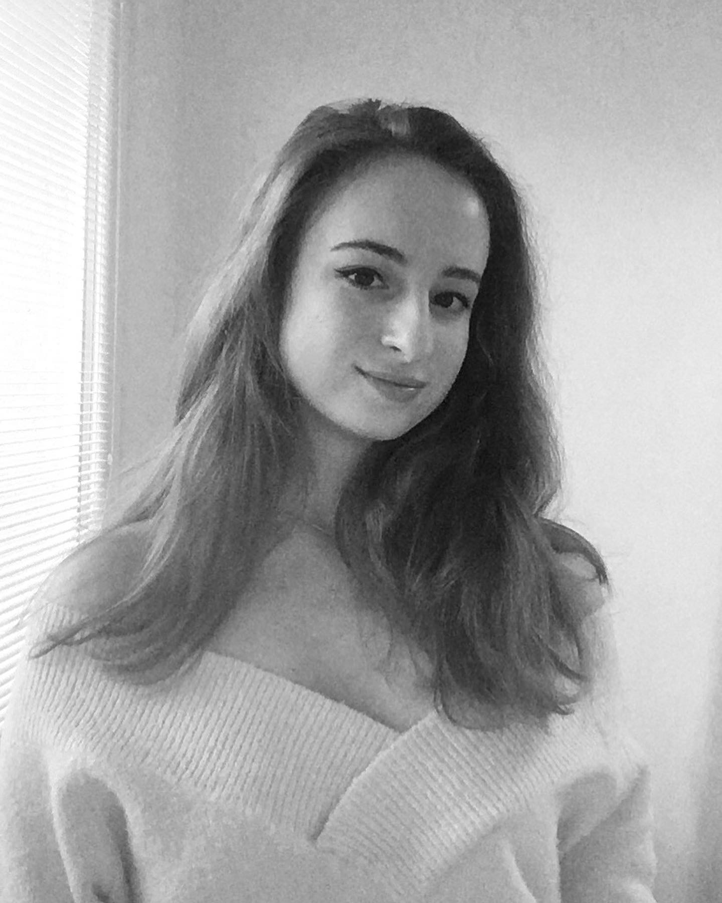
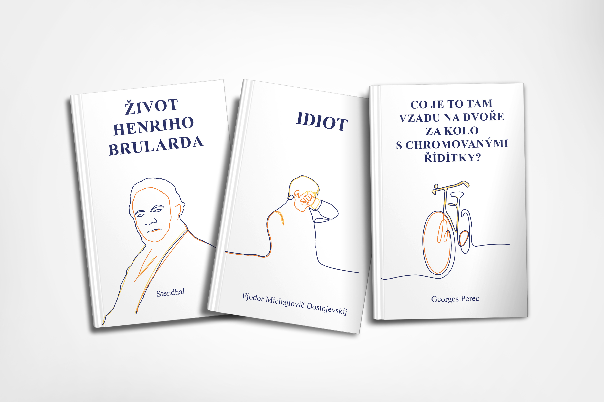
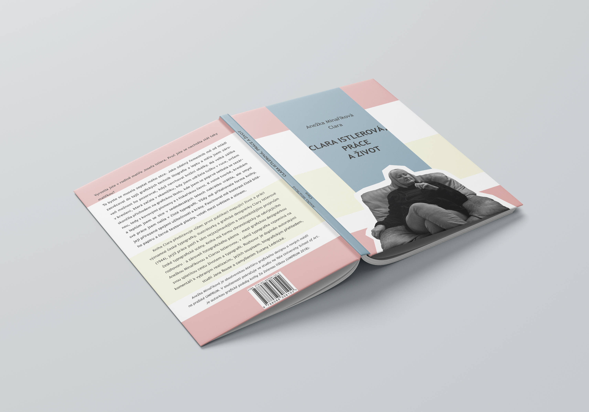
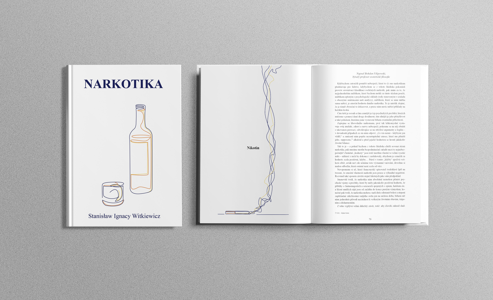
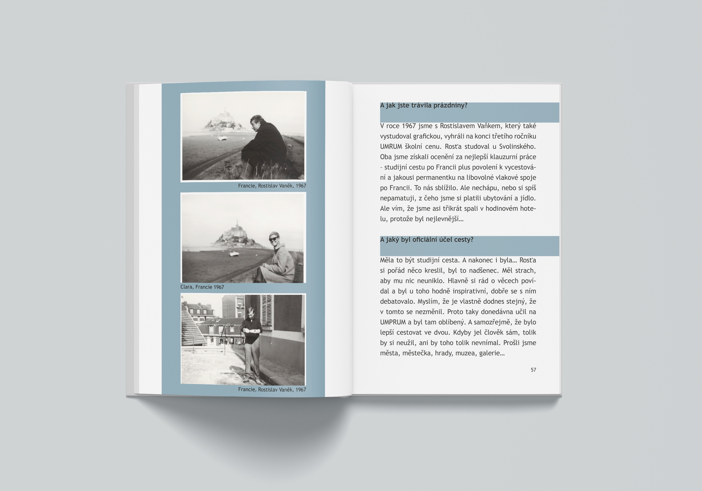
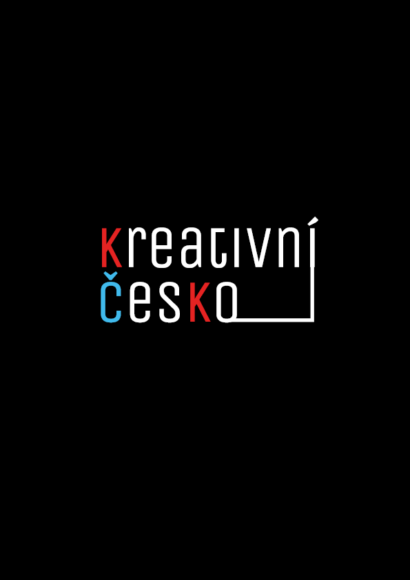
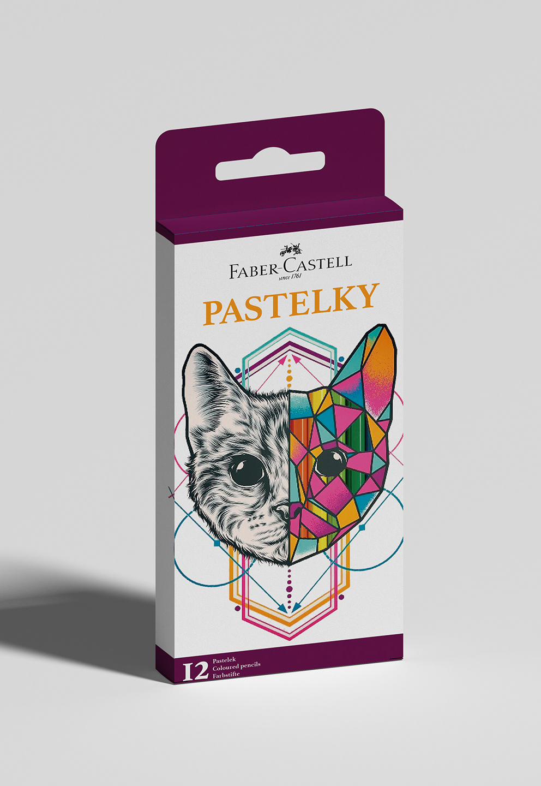
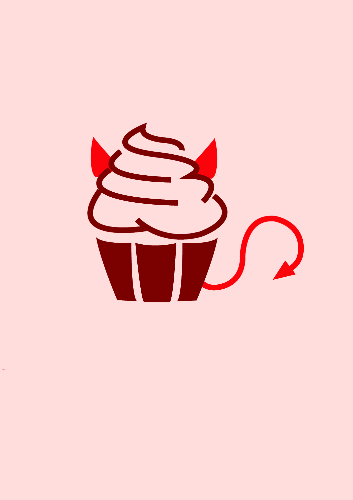
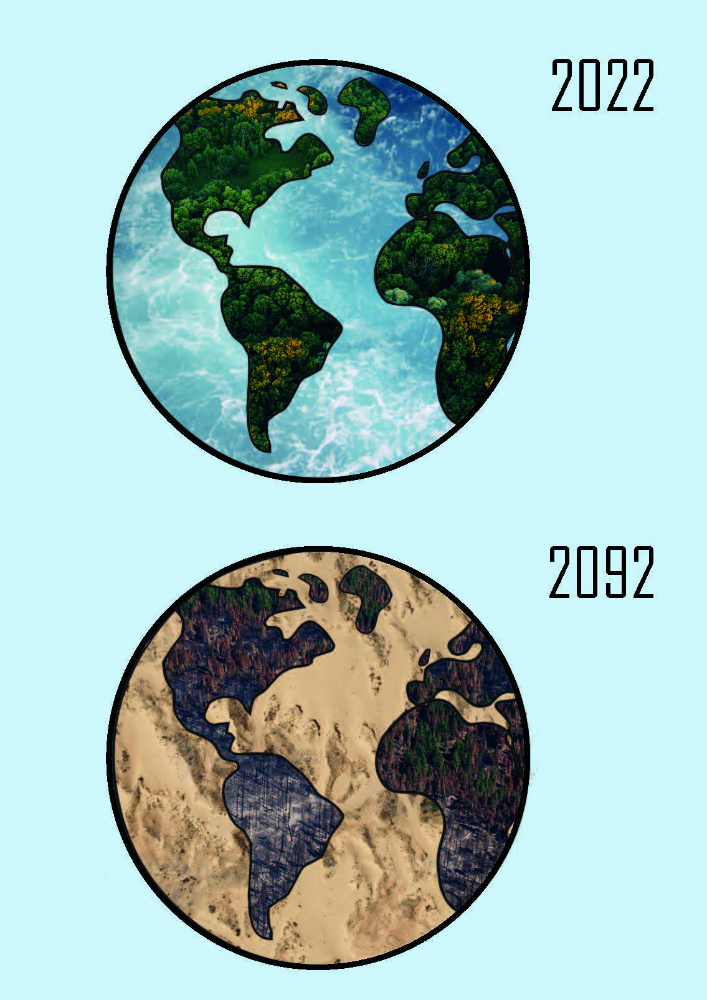

# First impression

I am a student at the University of Creative Communication specializing in graphic design.

<a href="https://adelakromp.myportfolio.com/">Visit my portfolio!</a>

…black and white photos, the answer to all your questions, thank you…

I gather experience in the field of graphics, media, marketing, typography, illustration and drawing.
I try to gradually improve in as many areas as possible in today's fast-paced world of advertising and media, so that I can then offer as many of my skills as possible.

As part of my studies, I also have experience with real clients; with the creation of a logo, visual identity, marketing campaign, social networks, typographic works including book layout and illustrations.

         

I love colors and their power. And books. (…Did you notice?)

Every project is a new challenge for me to improve.
