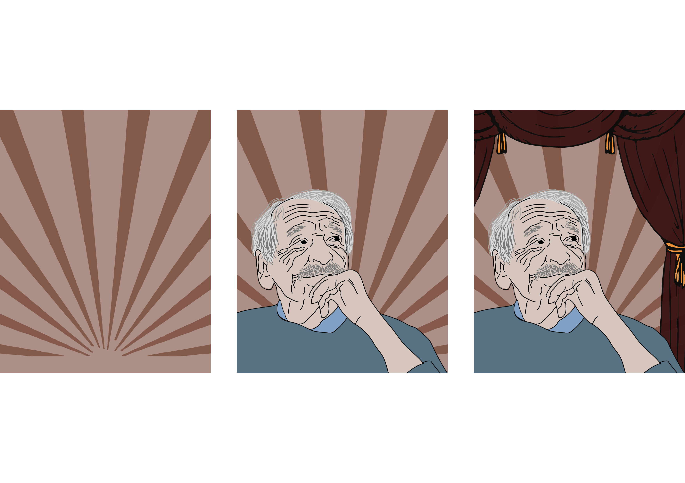

# Case study

This is about one awesome project, which is being held on Instagram.

There's an Instagram page called ###<a href="https://www.instagram.com/historickeokenko/">Historické okénko</a> which adds posts about some interestng historical events, which happened at that day, every day. Birth or death anniversary of famous people from Czech and world, important or less important historical events, tragedy, or sometimes just fun stuffs (for examples, <a href="https://www.instagram.com/p/ChsnHMSLQX6/">the invention of instant noodles</a>).

I found this at the end of 2020 and was really interested about it. I was keen on history before and I really liked those illustrations. Also I find descriptions funny for being slightly nonliterary, sometimes a bit vulgarly, but definitely funny. I think that's the way to remember history easier.

Every illustator has his own style of drawing, something what defines him. 
That was the thing why I wanted to have my own too. 

All of my illustrations have satured monochrome background. With the background colour I try to capture the whole mood of the illustration. The rest of it is drawn by hand, with few simple lines, sometimes a bit imperfectly (yup, it has its purpose) and with no shading.

It's probably the most easiest way of illustration but I adore it and every of them has something from me in it.
Also I must humbly add that all feedbacks on some of my work were positive.

The simpliest ones are for famous people, where I choose some famous photo and redraw it with my hand, often then I add colours based on topic or mood of the whole picture.

This is one of my most favourite illustration. It is portrait of Jaroslav Weigel, actor from my favourite Jara Cimrman's theatre. This picture was drawn for the his birth anniversary.
