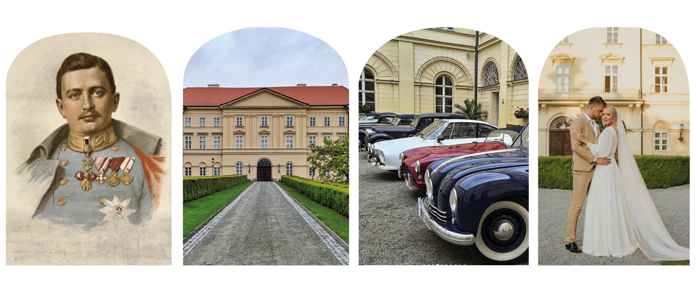
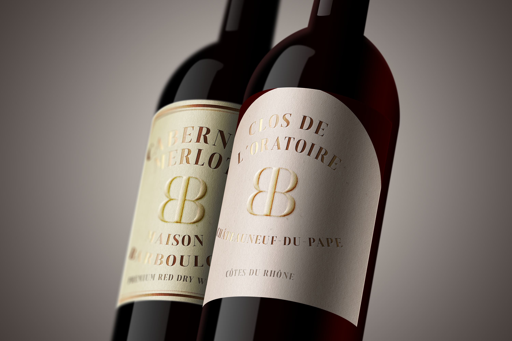

## My bachelor's thesis

# Visual identity and communication for the private castle Boskovice

[PDF file is here!](bachelor_presentation.pdf)

I am a big enthusiast of historical landmarks and history in general. That's why my bachelor's thesis topic is related to this hobby of mine. 
I wanted to combine history and heritage objects with the field that I am studying, and I hope I managed to do so.

The Boskovice Castle currently lacks clear visual communication. All communication, whether on social media or the website, is conveyed through photographs of the castle building and its interiors. The castle doesn't have a defined visual style and therefore lacks a way to differentiate itself from competitors, as it lacks any distinctive memorable aspect. 

  

From the beginning, I knew that I wanted to portray the Boskovice Castle in a more elegant manner than it has been done so far. My intention was to showcase the castle as a significant regional object with a rich history that still has a lot to offer. I wanted it to be perceived as a prominent place in a small town where a broader public can gather not only to learn about the history and castle past but also for relaxation or cultural experience. As the castle is privately owned by an important aristocratic family originally from France, I didn't want it to appear cheap or similar to state-owned objects. In the overall concept, I tried to highlight the ubiquitous and unique atmosphere of the noble residence and suggest, in an elegant way, that it is accessible to everyone interested in history, culture, or entertainment, while still fitting in with the mood of the castle complex.

### The concept of visual identity

### Color palette

I took the gold and dark blue colors from the coat of arms of the family that owns the castle. Since the combination of gold and blue is typical for castles, I looked for colors that would appropriately differentiate Boskovice Castle, and shades of green seemed to be the best choice. It corresponds to the castle garden, greenhouse, and outdoor events, which are often held there. At the same time, it is more modern, highlighting the castle's use for modern-day purposes. The cream color reflects not only the colors of the entrance hall and staircase but also a certain elegance, delicacy, and minimalism of French design.

### Playing with letters

To complete the entire visual and emphasize the concept, I also played around with the font.

### Logotype

In the context of the castle's visual identity, the logo itself is not as important because the castle does not communicate solely through the logo, as is the case with other corporate identities, but through the overall design as such. The logo serves as a complementary element that reflects the concept of the visual style and its main aspects. It is therefore symmetrical and consists of two mirrored capital letters B. It is complemented by the name of the castle. The logo appears simple and modern, but at the same time fits the castle object and complements the entire visual style.

### Photos

Some photographs are cropped into an arched shape, which is inspired by the shape of the castle windows. The task of such improved photographs or images is to demonstrate a connection with the castle architecture, with similarly shaped typography, the visual will naturally connect and distinguish the entire object from others.

### Voilà!

The main element of the visual identity concept, symmetry, is once again addressed through typography composition in all posters. I am not afraid to deviate from the given color scheme, because these are mostly cultural events that offer greater color freedom due to their diverse character. Thanks to the other design elements that are reflected throughout the entire visual identity, I connect the main idea of the entire identity. Here, I combine the arc shape of photographs, the shape and placement of the pattern, typography elements, and multiple shades of colors.

With the tickets, I also wanted them to serve as a design image for souvenir purposes.

I designed the covers for two publications that focus on the history of the castle and the Mensdorff-Pouilly family. Here, it was also necessary to somehow display the visual style, although not to the same extent as with the posters or tickets. However, since these are publications about the castle that serve its promotion, it was necessary to stick to the basic principles of the style, so symmetry, basic colors, and the shape of photographs are used here again. Through design, I tried to depict the difference between the genres or themes of the books; the book about the Mensdorff-Pouilly family is more sophisticated, professional, and decorative, while the publication about the castle itself appears more approachable and the design does not reflect a certain strictness and respect as in the case of the book about the aristocratic family.

I have designed the landing page for Boskovice Castle website. It serves as a base for the most important information and as a gateway for searching more detailed information. My goal was to create a functional website that is simple, clear, and reflects the visual style and concept. The entire web design system is based on visual identity.

I also decided to design letter paper and envelopes that could be used for sending the aforementioned postcards. Although sending paper letters is rather exceptional in today's online age, it fits the atmosphere and idea of the whole castle and suggests a return to the historical way of delivering messages. The letter paper and envelope look more ostentatious than ordinary stationery and thus suit the castle environment. The colors, typography, and slightly hinted pattern correspond with other communication materials of the castle's visual identity.

I wanted somewhat unconventional items that would differentiate Boskovice Castle from other objects and also be typical of it. By designing wine labels, I suggest that Boskovice Castle is located in the South Moravian region, which is renowned primarily for its vineyards.

Navigation elements are an indispensable part of any tourist attraction. They contain additional information regarding its operation and organization. Information boards are carriers of detailed information, such as what can be seen here, price lists, invitations to other sights in the area, and so on. It is also necessary to somehow incorporate at least the basic elements of visual identity to ensure that all visual information with which visitors come into contact during their visit to the attraction appears unified, attractive, and evokes a sense of familiarity in them later on.

### Communication

From the beginning, I wanted to portray Boskovice Castle as an elegant place where the public can experience a cultural and historical journey, relax, and immerse themselves in the atmosphere of aristocratic surroundings. Since the castle is privately owned by a significant noble family, I could not afford to communicate with the public using commonly known phrases used by most state-owned facilities in the Czech Republic. My intention was to use a suitable tone of communication to show that Boskovice Castle has a certain level of accessibility to those who resonate with it and seek experiences and entertainment in a similar spirit. However, I also needed to be careful not to overdo the communication style with excessive nobility, as I did not want the castle to be perceived as too luxurious and only for a select target group.

I kept the main slogan of the castle communication, which is "Zámek Boskovice: Empire Pearl of Moravia."

## Thank you for your attention and visit castles!

